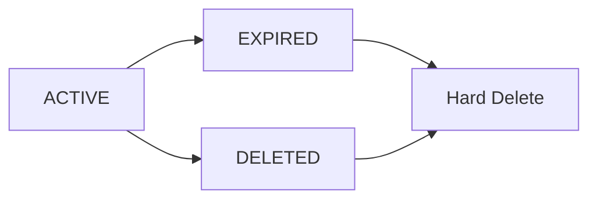

This page documents the business rules, algorithms, and behaviors that govern the ADMA Cloud URL Shortener application.

## Link Types and Lifecycle

### Link Types

The system supports two types of short links:

| Link Type | Owner | Expiration | Use Case |
|-----------|-------|------------|----------|
| **TEMPORARY** | Anonymous (no user) | 8 hours from creation | Quick, one-time sharing without registration |
| **PERMANENT** | Registered user | Never expires | Long-term URLs for authenticated users |

### Link Status Lifecycle

Every short URL goes through the following status lifecycle:



<Info>
**Status Definitions**:
- **ACTIVE**: Link is live and accepting redirects
- **EXPIRED**: Temporary link has passed its 8-hour TTL
- **DELETED**: User soft-deleted the link (can be purged)
</Info>

---

## Anonymous Link TTL (Time-to-Live)

<Note>
Anonymous links are designed for temporary sharing and automatically expire after 8 hours.
</Note>

### Configuration

**Backend**: `ShortUrlServiceImpl.java:48`
```java
static final int ANON_TTL_HOURS = 8;
```

**Frontend**: `localUrlStore.ts:30`
```typescript
const TTL_MS = 8 * 60 * 60 * 1000; // 8 hours
```

<Warning>
**Synchronization Requirement**: The TTL values in backend and frontend **must always match**. If you change one, update the other.
</Warning>

### How It Works

1. **Creation**: When an anonymous user creates a short URL via `POST /api/urls/public`, the backend:
   - Sets `expiresAt = now + 8 hours`
   - Sets `linkType = TEMPORARY`
   - Sets `userId = null`
   - Sets `status = ACTIVE`

2. **Client Storage**: The frontend stores the URL in `localStorage` with the same 8-hour expiration

3. **Expiration Check**: On every redirect attempt (`GET /{shortCode}`), the backend:
   - Checks if `expiresAt < now`
   - If expired, returns **HTTP 410 Gone** (not 404)
   - Updates status to `EXPIRED` in database

4. **Cleanup**: A scheduled job runs every 15 minutes to permanently delete expired links

### Example Timeline

| Time | Event |
|------|-------|
| **00:00** | Anonymous user creates link, `expiresAt = 08:00` |
| **00:00 - 07:59** | Link is ACTIVE, redirects work normally |
| **08:00** | Link expires |
| **08:00+** | Redirect attempts return HTTP 410 Gone |
| **08:15** | Cleanup job marks link as EXPIRED |
| **08:15+** | Cleanup job hard-deletes the expired link |

---

## Permanent Links

<Info>
Registered users create permanent links that never expire.
</Info>

### Characteristics

- **Ownership**: Linked to authenticated user via `userId`
- **Expiration**: `expiresAt = null` (never expires)
- **Link Type**: `linkType = PERMANENT`
- **Visibility**: Only visible to the owner in their dashboard
- **Deletion**: Owner can soft-delete via `DELETE /api/urls/{id}`

### Anonymous to Permanent Conversion

When a user registers or logs in, their anonymous URLs from `localStorage` are synced to their account via `POST /api/urls/sync`:

1. Frontend sends array of original URLs from `localStorage`
2. Backend claims existing anonymous entries OR creates new ones
3. Claimed entries are updated:
   - `userId` set to authenticated user
   - `linkType` changed to `PERMANENT`
   - `expiresAt` set to `null`
4. Frontend clears `localStorage`

**Implementation**: `ShortUrlServiceImpl.java:176-219`

---

## HTTP Status Codes for Links

### Redirect Endpoint (`GET /{shortCode}`)

The redirect endpoint returns different HTTP status codes based on link state:

| Status Code | Condition | Meaning |
|-------------|-----------|----------|
| **302 Found** | Link is ACTIVE and valid | Successful redirect to `originalUrl` |
| **404 Not Found** | Short code doesn't exist | Link was never created or already hard-deleted |
| **410 Gone** | Link is EXPIRED | Link existed but has expired (temporary link past 8h TTL) |

<Note>
**Why 410 instead of 404 for expired links?**

HTTP 410 Gone explicitly indicates the resource **existed in the past** but is **permanently unavailable**. This is semantically correct for expired links and helps search engine crawlers understand the link won't return.

From RFC 7231:
> "The 410 response is primarily intended to assist the task of web maintenance by notifying the recipient that the resource is intentionally unavailable and that the server owners desire that remote links to that resource be removed."
</Note>

**Implementation**: `RedirectController.java` + `GlobalExceptionHandler.java`

```java
// ShortUrlServiceImpl.java:117-124
if (shortUrl.isExpiredNow()) {
    if (shortUrl.getStatus() == LinkStatus.ACTIVE) {
        shortUrl.setStatus(LinkStatus.EXPIRED);
        shortUrlRepository.save(shortUrl);
    }
    throw new LinkExpiredException(shortCode);
}
```

---

## Automated Cleanup Jobs

<Warning>
**Distributed Safety**: The cleanup job uses **ShedLock** to ensure only one backend instance executes the job at a time, even when multiple replicas are running on AWS ECS Fargate.
</Warning>

### Cleanup Schedule

**Service**: `ExpiredUrlCleanupService.java`

**Schedule**: Every 15 minutes with 1-minute initial delay

**Lock Configuration**:
- `lockAtLeastFor`: 10 minutes (prevents immediate re-execution)
- `lockAtMostFor`: 14 minutes (safety timeout if job hangs)

### Two-Phase Cleanup Strategy

<Info>
The cleanup uses a two-phase approach to prevent race conditions with redirect checks:
</Info>

**Phase 1 - Mark Expired**:
```sql
UPDATE short_urls 
SET status = 'EXPIRED' 
WHERE expires_at < NOW() AND status = 'ACTIVE'
```

**Phase 2 - Hard Delete**:
```sql
DELETE FROM short_urls 
WHERE status IN ('EXPIRED', 'DELETED')
```

### Why Two Phases?

This prevents a race condition where:
1. User requests redirect for expiring link
2. Cleanup job deletes the row mid-request
3. Redirect endpoint queries for the link
4. Gets 404 (not found) instead of 410 (expired)

By first marking as EXPIRED, the redirect logic can read the status and return the correct HTTP 410.

### ShedLock Configuration

ShedLock stores distributed lock state in PostgreSQL:

**Table**: `shedlock` (created by `db/shedlock.sql`)

**Configuration**: `AppConfig.java:25`
```java
@EnableSchedulerLock(defaultLockAtMostFor = "PT14M")
```

<Accordion title="ShedLock Table Schema">

```sql
CREATE TABLE shedlock (
    name       VARCHAR(64)  NOT NULL PRIMARY KEY,
    lock_until TIMESTAMP    NOT NULL,
    locked_at  TIMESTAMP    NOT NULL,
    locked_by  VARCHAR(255) NOT NULL
);
```

</Accordion>

<Warning>
**AWS ECS Deployment Note**: 

If you run multiple backend replicas (`desiredCount > 1`), ShedLock ensures only one instance executes cleanup. However, for simplicity, the reference architecture uses `desiredCount = 1` for the backend service.

For production horizontal scaling, consider:
- Moving cleanup to a separate ECS Scheduled Task
- Using AWS Lambda with EventBridge (CloudWatch Events)
- Using a job queue (SQS + worker)
</Warning>

---

## Welford's Algorithm for Latency Tracking

<Note>
The system tracks average redirect latency using **Welford's online algorithm** for computing a running mean without storing historical data.
</Note>

### Why Welford's Algorithm?

Traditional averaging requires storing all values or maintaining a sum and count. Welford's algorithm computes the mean incrementally with:
- **O(1) space** (only stores current mean and count)
- **O(1) time per update**
- **Numerically stable** (avoids overflow/underflow)

### Implementation

**Location**: `ShortUrlServiceImpl.java:130-132`

```java
// Welford's online mean: μₙ = μₙ₋₁ + (xₙ − μₙ₋₁) / n
long newCount = shortUrl.getRedirectCount() + 1;
double prev = shortUrl.getAvgRedirectMs() == null ? 0.0 : shortUrl.getAvgRedirectMs();
shortUrl.setAvgRedirectMs(prev + ((double) redirectLatencyMs - prev) / newCount);
```

### How It Works

**Formula**: `μₙ = μₙ₋₁ + (xₙ − μₙ₋₁) / n`

Where:
- `μₙ` = new average after n measurements
- `μₙ₋₁` = previous average
- `xₙ` = new measurement (current redirect latency)
- `n` = total count of measurements

**Example**:

| Redirect # | Latency (ms) | Previous Avg | Calculation | New Avg |
|------------|--------------|--------------|-------------|----------|
| 1 | 150 | 0.0 | 0 + (150 - 0) / 1 | 150.0 |
| 2 | 200 | 150.0 | 150 + (200 - 150) / 2 | 175.0 |
| 3 | 180 | 175.0 | 175 + (180 - 175) / 3 | 176.67 |
| 4 | 160 | 176.67 | 176.67 + (160 - 176.67) / 4 | 172.5 |

### Latency Measurement

**Measurement Point**: `RedirectController.java`

The latency is measured from when the redirect controller receives the request until just before returning the redirect response:

```java
long startMs = System.currentTimeMillis();
String originalUrl = shortUrlService.resolveShortCode(shortCode, 0L);
long latencyMs = System.currentTimeMillis() - startMs;

// Update analytics with measured latency
shortUrlService.resolveShortCode(shortCode, latencyMs);
```

<Info>
This measures **server-side processing time** only, not network round-trip time or client rendering time.
</Info>

---

## Soft Delete

<Note>
Deleted links are not immediately removed from the database. They are marked as DELETED and purged by the cleanup job.
</Note>

### Soft Delete Process

1. User calls `DELETE /api/urls/{id}` with JWT token
2. Backend verifies ownership (`userId` matches authenticated user)
3. Status changes from `ACTIVE` to `DELETED`
4. Link is no longer visible in user's dashboard
5. Redirects to deleted links return **404 Not Found**
6. Next cleanup job (≤15 min) hard-deletes the row

**Implementation**: `ShortUrlServiceImpl.java:157-171`

```java
shortUrl.setStatus(LinkStatus.DELETED);
shortUrlRepository.save(shortUrl);
```

### Why Soft Delete?

**Benefits**:
- **Audit trail**: Temporarily preserves data for debugging/analytics
- **Undo capability**: Could implement "restore" feature
- **Analytics**: Redirect counts remain accurate during cleanup window
- **Race condition safety**: Redirect checks see DELETED status vs. missing row

**Trade-offs**:
- Deleted data remains up to 15 minutes
- Requires cleanup job to purge

---

## Short Code Generation

### Algorithm

**Service**: `ShortCodeGenerator.java`

**Character Set**: `[a-zA-Z0-9]` (62 characters)

**Length**: 7 characters (default)

**Collision Space**: 62^7 = 3,521,614,606,208 possible codes (~3.5 trillion)

### Collision Handling

**Max Retries**: 5 attempts

**Implementation**: `ShortUrlServiceImpl.java:228-238`

```java
private String generateUniqueCode() {
    for (int attempt = 0; attempt < MAX_COLLISION_RETRIES; attempt++) {
        String code = shortCodeGenerator.generate();
        if (!shortUrlRepository.existsByShortCode(code)) {
            return code;
        }
        log.debug("Short code collision on attempt {}/{}", attempt + 1, MAX_COLLISION_RETRIES);
    }
    throw new IllegalStateException(
        "Failed to generate a unique short code after " + MAX_COLLISION_RETRIES + " attempts");
}
```

<Info>
**Collision Probability**: With 7 alphanumeric characters, the probability of collision remains negligible until hundreds of millions of links are created.
</Info>

---

## Analytics Tracking

Each short URL tracks the following analytics:

| Metric | Type | Description |
|--------|------|-------------|
| `redirectCount` | Long | Total number of times the link was accessed |
| `avgRedirectMs` | Double | Running average redirect latency (Welford's algorithm) |
| `destinationStatus` | Integer | Last HTTP status of destination URL health check |
| `lastCheckedAt` | Instant | Timestamp of last destination availability check |

**Domain Model**: `ShortUrl.java:103-126`

### Global Platform Statistics

The system provides public aggregate statistics via `GET /api/stats`:

| Stat | Description |
|------|-------------|
| `totalLinks` | Count of all ACTIVE short URLs (both temporary and permanent) |
| `totalRedirects` | Sum of all `redirectCount` across all links |
| `avgLatencyMs` | Global average redirect latency across all links |

**Implementation**: `ShortUrlRepository.java` (JPQL aggregates)

---

## Security Rules

### Password Hashing

**Algorithm**: BCrypt

**Cost Factor**: 12 (OWASP recommendation)

**Configuration**: `SecurityConfig.java:59-61`

```java
@Bean
public PasswordEncoder passwordEncoder() {
    return new BCryptPasswordEncoder(12);
}
```

<Warning>
**OWASP Recommendation**: BCrypt with cost factor 12 is the current recommendation for password hashing. Never lower this value in production.
</Warning>

### JWT Token Validation

**Algorithm**: HS256 (HMAC-SHA256)

**Minimum Secret Length**: 32 characters (256 bits)

**Default Expiration**: 24 hours (86400000 ms)

**Validation**: `JwtTokenProvider.java:79-95`

Tokens are validated on every authenticated request via `JwtAuthenticationFilter`:
- Signature verification
- Expiration check
- Subject (email) extraction

### Access Control

Users can only:
- **View** their own short URLs
- **Delete** their own short URLs
- **Create** new short URLs (authenticated or anonymous)

**Enforcement**: `ShortUrlServiceImpl.java:157-171`

```java
if (!owner.getId().equals(shortUrl.getUserId())) {
    throw new UnauthorizedException("You do not own this short URL");
}
```

---

## Business Rule Summary

<Accordion title="Quick Reference Table">

| Rule | Value | Location |
|------|-------|----------|
| Anonymous TTL | 8 hours | `ShortUrlServiceImpl.java:48`, `localUrlStore.ts:30` |
| Cleanup Job Interval | 15 minutes | `ExpiredUrlCleanupService.java:44` |
| ShedLock Duration | 10-14 min | `ExpiredUrlCleanupService.java:45` |
| JWT Expiration | 24 hours | `application.yml:50` |
| JWT Algorithm | HS256 | `JwtTokenProvider.java` |
| JWT Min Secret Length | 32 chars | `JwtTokenProvider.java` |
| BCrypt Cost Factor | 12 | `SecurityConfig.java:60` |
| Short Code Length | 7 chars | `ShortCodeGenerator.java` |
| Short Code Charset | `[a-zA-Z0-9]` | `ShortCodeGenerator.java` |
| Collision Retries | 5 | `ShortUrlServiceImpl.java:45` |
| Expired Link HTTP Code | 410 Gone | `GlobalExceptionHandler.java` |
| Missing Link HTTP Code | 404 Not Found | `GlobalExceptionHandler.java` |
| Redirect HTTP Code | 302 Found | `RedirectController.java` |
| Connection Pool Max | 10 | `application.yml:18` |
| Connection Pool Min Idle | 2 | `application.yml:19` |

</Accordion>

---

## Related Documentation

- [Environment Variables](/api/environment-variables) - Configuration reference
- [API Authentication](/api/authentication) - Authentication endpoints
- [URL Management](/api/url-management) - URL management endpoints