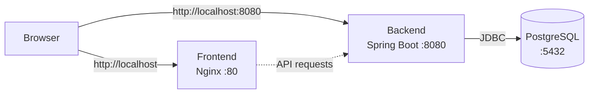

This guide covers everything you need for productive local development with the ADMA URL Shortener.

## Architecture Overview

The local development environment uses Docker Compose to orchestrate three services:



## Environment Configuration

### Backend Variables

The backend reads configuration from environment variables defined in `docker-compose.yml`. You can override any of these by creating a `.env` file in the project root:

<CodeGroup>

```yaml docker-compose.yml (defaults)
services:
  backend:
    environment:
      DB_HOST: postgres
      DB_PORT: 5432
      DB_NAME: urlshortener
      DB_USERNAME: postgres
      DB_PASSWORD: changeme
      JWT_SECRET: changeme-this-must-be-at-least-32-chars-long!!
      JWT_EXPIRATION_MS: 86400000  # 24 hours
      SERVER_PORT: 8080
      APP_BASE_URL: http://localhost:8080
      CORS_ALLOWED_ORIGINS: http://localhost,http://localhost:80,http://localhost:3000,http://localhost:5173,http://frontend:80
```

```env .env (custom overrides)
# Create this file to override defaults
DB_NAME=urlshortener_dev
DB_PASSWORD=my_secure_password
JWT_SECRET=super_secret_key_at_least_32_characters_long
JWT_EXPIRATION_MS=3600000  # 1 hour
APP_BASE_URL=http://localhost:8080
```

</CodeGroup>

<Note>
After creating or modifying `.env`, restart services: `docker compose up -d`
</Note>

#### Backend Environment Variables Reference

| Variable | Required | Default | Description |
|----------|----------|---------|-------------|
| `DB_HOST` | Yes | `postgres` | PostgreSQL hostname (use service name in Docker Compose) |
| `DB_PORT` | Yes | `5432` | PostgreSQL port |
| `DB_NAME` | Yes | `urlshortener` | Database name |
| `DB_USERNAME` | Yes | `postgres` | Database user |
| `DB_PASSWORD` | Yes | `changeme` | Database password |
| `JWT_SECRET` | Yes | _(default provided)_ | JWT signing key (min. 32 characters) |
| `JWT_EXPIRATION_MS` | No | `86400000` | JWT token lifetime in milliseconds (24h default) |
| `SERVER_PORT` | No | `8080` | Backend server port |
| `APP_BASE_URL` | Yes | `http://localhost:8080` | Base URL for generating short links |
| `CORS_ALLOWED_ORIGINS` | Yes | _(localhost variants)_ | Comma-separated list of allowed origins |

<Warning>
**Security**: The default `JWT_SECRET` is for development only. Generate a secure secret for production:

```bash
openssl rand -base64 48
```
</Warning>

### Frontend Variables

The frontend uses Vite, which embeds environment variables **at build time**. The backend API URL is configured via `VITE_API_BASE_URL`:

<CodeGroup>

```yaml docker-compose.yml
services:
  frontend:
    build:
      context: ./frontend
      args:
        VITE_API_BASE_URL: ${VITE_API_BASE_URL:-http://localhost:8080}
```

```env .env
# Override frontend API URL (requires rebuild)
VITE_API_BASE_URL=http://localhost:8080
```

</CodeGroup>

<Warning>
**Important**: `VITE_API_BASE_URL` is baked into the static JavaScript bundle during build. If you change it, you **must rebuild** the frontend:

```bash
docker compose up -d --build frontend
```
</Warning>

## Hot Reload & Development Workflow

### Backend Hot Reload

The backend Dockerfile uses a multi-stage build that compiles the full JAR. For faster development:

#### Option 1: Use Spring Boot DevTools (Recommended)

1. Stop the Docker backend: `docker compose stop backend`
2. Run the backend directly with Gradle:

```bash
cd backend
./gradlew bootRun
```

DevTools will automatically restart the app when you change Java files.

<Tip>
Make sure PostgreSQL is still running: `docker compose up -d postgres`
</Tip>

#### Option 2: Volume Mount (Advanced)

Mount your local source code into the container for quicker rebuilds:

```yaml docker-compose.override.yml
services:
  backend:
    volumes:
      - ./backend/src:/app/src:ro
    command: gradle bootRun --continuous
```

### Frontend Hot Reload

For frontend development with instant refresh:

1. Stop the Docker frontend: `docker compose stop frontend`
2. Run Vite dev server locally:

```bash
cd frontend
bun install
bun run dev
```

The dev server runs at `http://localhost:5173` with HMR (Hot Module Replacement).

<Note>
Make sure your `.env.local` file has:

```env
VITE_API_BASE_URL=http://localhost:8080
```
</Note>

## Debugging

### Backend Debugging with IntelliJ IDEA

<Steps>

<Step title="Enable debug port in docker-compose">

Create `docker-compose.override.yml`:

```yaml
services:
  backend:
    environment:
      JAVA_TOOL_OPTIONS: -agentlib:jdwp=transport=dt_socket,server=y,suspend=n,address=*:5005
    ports:
      - "5005:5005"
```

Restart: `docker compose up -d backend`

</Step>

<Step title="Configure IntelliJ Remote Debug">

1. Go to **Run** → **Edit Configurations**
2. Click **+** → **Remote JVM Debug**
3. Set **Host**: `localhost`, **Port**: `5005`
4. Click **OK**

</Step>

<Step title="Start debugging">

Set breakpoints in your Java code and click the **Debug** button. IntelliJ will attach to the running container.

</Step>

</Steps>

### Backend Debugging with VS Code

Add to `.vscode/launch.json`:

```json
{
  "version": "0.2.0",
  "configurations": [
    {
      "type": "java",
      "name": "Attach to Backend",
      "request": "attach",
      "hostName": "localhost",
      "port": 5005
    }
  ]
}
```

### Frontend Debugging

Use browser DevTools or VS Code's built-in debugger:

```json .vscode/launch.json
{
  "version": "0.2.0",
  "configurations": [
    {
      "type": "chrome",
      "request": "launch",
      "name": "Launch Chrome",
      "url": "http://localhost:5173",
      "webRoot": "${workspaceFolder}/frontend/src"
    }
  ]
}
```

## Database Access

### Connect with psql

```bash
docker compose exec postgres psql -U postgres -d urlshortener
```

Useful commands:

```sql
-- List all tables
\dt

-- Show table schema
\d short_url

-- Query recent links
SELECT short_code, original_url, created_at FROM short_url ORDER BY created_at DESC LIMIT 10;

-- Count active links
SELECT link_status, COUNT(*) FROM short_url GROUP BY link_status;
```

### Connect with GUI Tools

Use any PostgreSQL client with these credentials:

| Setting | Value |
|---------|-------|
| Host | `localhost` |
| Port | `5432` |
| Database | `urlshortener` |
| Username | `postgres` |
| Password | `changeme` |

Popular clients: pgAdmin, DBeaver, TablePlus, Postico

### Reset Database

To start fresh with a clean database:

```bash
# Delete volume and recreate
docker compose down -v
docker compose up -d
```

<Warning>
This will **permanently delete all data** including users, links, and analytics!
</Warning>

## Logs & Monitoring

### View Logs

<CodeGroup>

```bash All services
docker compose logs -f
```

```bash Backend only
docker compose logs -f backend
```

```bash Last 100 lines
docker compose logs --tail=100 backend
```

```bash Filter by keyword
docker compose logs backend | grep ERROR
```

</CodeGroup>

### Application Logs

Backend logging is configured in `application.yml`:

```yaml
logging:
  level:
    root: INFO
    adma.sa2_sa3.backend: DEBUG  # Your application logs
```

Change to `TRACE` for even more verbose output during debugging.

## Testing

### Backend Tests

```bash
cd backend
./gradlew test
```

### Frontend Tests

```bash
cd frontend
bun test          # Run once
bun test --watch  # Watch mode
```

## Common Development Tasks

### Add a Database Migration

The app uses Hibernate's `ddl-auto: update` in development, which automatically creates/updates tables. For production, you should use Flyway or Liquibase.

<Tip>
Table schema is defined in Java entities at `backend/src/main/java/adma/sa2_sa3/backend/domain/`
</Tip>

### Change Backend Port

Edit `docker-compose.yml`:

```yaml
services:
  backend:
    environment:
      SERVER_PORT: 9000
    ports:
      - "9000:9000"  # Host:Container
```

Don't forget to update `VITE_API_BASE_URL` and rebuild the frontend!

### Enable CORS for New Origin

Add to `CORS_ALLOWED_ORIGINS` in docker-compose.yml:

```yaml
environment:
  CORS_ALLOWED_ORIGINS: http://localhost,http://localhost:3000,http://192.168.1.100:3000
```

## Performance Optimization

### Spring Boot JVM Settings

The backend Dockerfile includes optimized JVM flags:

```dockerfile
ENTRYPOINT ["java", \
  "-XX:+UseContainerSupport", \
  "-XX:MaxRAMPercentage=75.0", \
  "-Djava.security.egd=file:/dev/./urandom", \
  "-jar", "app.jar"]
```

- `UseContainerSupport`: Detect container memory limits
- `MaxRAMPercentage=75.0`: Use 75% of available container memory
- `java.security.egd`: Faster random number generation

### PostgreSQL Connection Pool

Adjust HikariCP settings in `application.yml`:

```yaml
spring:
  datasource:
    hikari:
      maximum-pool-size: 10  # Max connections
      minimum-idle: 2        # Keep 2 connections ready
      connection-timeout: 30000  # 30 seconds
```

## Troubleshooting

<AccordionGroup>

<Accordion title="Backend exits with 'Cannot connect to database'">

PostgreSQL may not be ready when the backend starts. The compose file includes a `depends_on` health check, but you can also manually check:

```bash
# Check postgres health
docker compose ps postgres

# View postgres logs
docker compose logs postgres

# Restart backend after postgres is ready
docker compose restart backend
```

</Accordion>

<Accordion title="Frontend shows blank page">

Check the browser console for errors. Common causes:

1. **VITE_API_BASE_URL mismatch**: The frontend was built with wrong API URL
   - Verify in browser DevTools → Network tab
   - Rebuild: `docker compose up -d --build frontend`

2. **CORS errors**: Backend doesn't allow the frontend origin
   - Add to `CORS_ALLOWED_ORIGINS` in docker-compose.yml
   - Restart backend: `docker compose restart backend`

</Accordion>

<Accordion title="Changes not reflected after rebuild">

Docker may be using cached layers:

```bash
# Force rebuild without cache
docker compose build --no-cache backend
docker compose up -d backend
```

For frontend, also clear browser cache (Cmd+Shift+R / Ctrl+Shift+R).

</Accordion>

<Accordion title="Port 8080/80 already in use">

Find and stop the conflicting process:

```bash
# macOS/Linux
lsof -ti:8080 | xargs kill -9

# Windows
netstat -ano | findstr :8080
taskkill /PID <PID> /F
```

Or change the port in `docker-compose.yml`.

</Accordion>

<Accordion title="'gradlew: Permission denied' error">

The Gradle wrapper needs execute permissions:

```bash
cd backend
chmod +x gradlew
```

</Accordion>

</AccordionGroup>

## Next Steps

<CardGroup cols={2}>
  <Card title="Deploy to AWS" icon="aws" href="/deployment/aws-setup">
    Deploy to production with ECS Fargate, RDS, and ALB
  </Card>
  <Card title="Architecture" icon="diagram-project" href="/architecture">
    Learn about the system design and business rules
  </Card>
</CardGroup>
